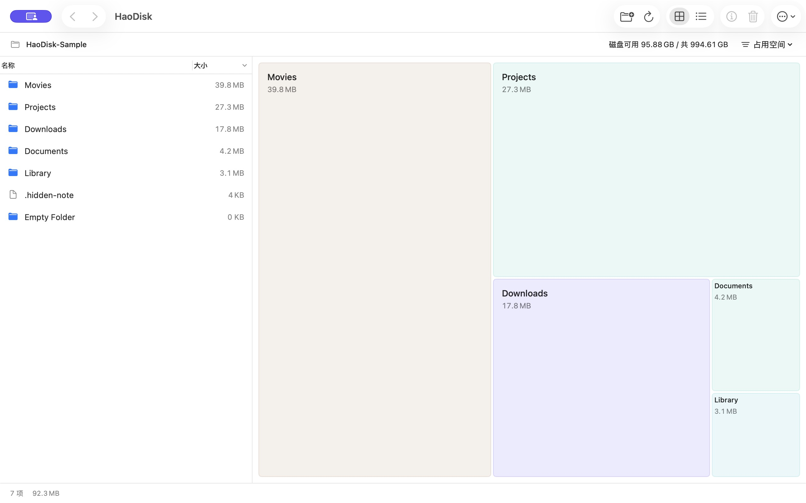

# HaoDisk

原生 macOS 磁盘空间分析与清理工具，使用 Swift、SwiftUI、AppKit 和系统 SQLite3 开发。

把空间，看明白。按文件夹查看大小和面积占比，逐层找到占空间的项目，检查后移到系统废纸篓。

[官方网站](https://skvdhshuk-blip.github.io/HaoDisk/) · [下载 Release](https://github.com/skvdhshuk-blip/HaoDisk/releases/latest) · [帮助与支持](https://skvdhshuk-blip.github.io/HaoDisk/support.html) · [隐私政策](https://skvdhshuk-blip.github.io/HaoDisk/privacy.html)



## 下载与版本

**最新版本：0.2.4（构建 6）**，支持 macOS 14 及以上，提供 Apple 芯片与 Intel 通用应用。免费、无广告、无内购，当前界面为简体中文。

| 渠道 | 状态 |
| --- | --- |
| [GitHub Release v0.2.4](https://github.com/skvdhshuk-blip/HaoDisk/releases/tag/v0.2.4) | 提供源码和通用 ZIP；使用 Hao Wang 的 Developer ID 签名，已通过 Apple 公证 |
| Mac App Store | 2026-09-06 已提交 0.2.4（6），等待 Apple 审核；通过后自动发布，首发不含欧盟 |
| 自行构建 | 使用 Xcode 打开工程并选择自己的开发者 Team，步骤见下方 |

下载 `HaoDisk-0.2.4-macOS.zip`，解压后将 `HaoDisk.app` 拖到“应用程序”即可打开。应用使用 `Developer ID Application: Hao Wang (M2WM2NJP68)` 签名，已通过 Apple 公证并附带公证凭证，macOS Gatekeeper 和分发检查通过。

Release 附带 `SHA256SUMS.txt` 和 `BUILD.json`；将三个附件放在同一目录，可用 `shasum -a 256 -c SHA256SUMS.txt` 校验下载内容。

## 0.2.5 清理规则修复（尚未发布）

- 普通项目路径中的 `Library` / `library` 不再触发保护；系统和用户主目录中的真实 Library 路径仍受保护。
- 普通父目录不再仅因包含应用或资料包而被禁用。包本身和包内项目仍不能直接加入待清理；清理父目录会连同其内容一起移到废纸篓。
- 读取完整性、清理前文件变化复核及真实受保护路径的限制保持不变。升级后重新扫描，使用新的清理判断结果。

## 0.2.4 更新

- **完整扫描**：取消 50 万项目的扫描硬上限，使用当前会话的 SQLite 临时索引，按需加载数据。
- **流畅浏览**：后台排序、分页与缓存，减少点击、滚动和方块悬停时的重复计算。
- **局部更新**：清理成功后仅更新受影响目录及祖先，保留浏览位置，无需重新扫描整个授权目录。
- **容量一眼可见**：顶部显示磁盘可用／总容量，方块优先显示名称与容量，保留小项目的真实面积比例。

## 功能

- 左侧目录列表与右侧矩形面积图联动，支持名称 / 大小双向排序、键盘选择与下钻、路径菜单、前进 / 后退和完整表格模式。
- 顶部常驻所选目录所在磁盘的可用空间与总容量，授权后即可读取，不必等待目录扫描完成。
- 面积图直接显示名称和容量；小块优先显示容量，保留真实比例。最多 80 个独立块，超出部分显示汇总容量并可进入列表。
- 切换磁盘占用空间与逻辑文件大小，方块面积和容量同步更新；占比可在悬停、简介与完整表格中查看。
- 后台扫描、实时进度、可取消、隐藏文件（含 `._` 文件）、硬链接去重和读取问题清单；同一目录重扫保留浏览位置、选择与有效清单。
- 目录排序在后台准备，按 512 行分页并预取相邻页；最多缓存 16 个目录 / 500,000 行，每个目录最多保留 8 页。原生列表复用可见行，方块悬停不重复排序和计算整图布局。
- 系统目录选择器授权；保存最近一个目录的授权，重启后可继续，随时忘记。
- 手动待清理清单、父子项去重、清理前文件与路径身份检查、文件夹内容复核、逐项结果反馈；成功清理只更新受影响目录及祖先，不自动重扫授权根目录。
- 原生深浅色外观、系统字体、键盘菜单、面积图辅助功能标签；不依赖 WebView。

## 在 Xcode 中运行

1. 用 Xcode 打开 `HaoDisk.xcodeproj`，已在 Xcode 26.6 验证。最低部署版本为 macOS 14。
2. 选择 `HaoDisk` scheme，在 Signing & Capabilities 中选择自己的开发者 Team；必要时更换 Bundle Identifier。
3. Run，点击“选择文件夹”并授权。
4. 单击选中，双击目录下钻，⌘I 显示简介；点击废纸篓或按 ⌘⌫ 审阅所选项目，再明确点击“移到废纸篓”。多个项目可经右键菜单先加入清单。

已提交完整 `.xcodeproj`，直接打开即可，无需安装 XcodeGen 或其他依赖。`project.yml` 仅供修改工程结构后重新生成使用。

```sh
# 无第三方依赖的核心测试
swift test

# 不依赖开发证书的本地构建检查
xcodebuild -project HaoDisk.xcodeproj -scheme HaoDisk \
  -configuration Release -derivedDataPath .build/xcode \
  CODE_SIGNING_ALLOWED=NO build

# Xcode 原生 XCTest；测试不会操作用户文件或清空废纸篓
xcodebuild -project HaoDisk.xcodeproj -scheme HaoDisk \
  -destination 'platform=macOS' CODE_SIGN_IDENTITY=- CODE_SIGNING_REQUIRED=NO test
```

## 容量与清理边界

| 情况 | 行为 |
| --- | --- |
| 符号链接 | 只统计链接本身，不跟随目标，交给 Finder 管理 |
| 硬链接 | 同一卷、同一文件身份计一次；容量归属首次遇到的目录 |
| 稀疏 / 压缩文件 | 逻辑大小与已分配大小分开显示 |
| APFS 克隆、快照、共享块 | 不声称能够精确计算实际可释放空间 |
| 云端占位文件 | 读取文件系统元数据，不读取正文、不主动下载 |
| 无权限目录、其他挂载卷 | 标记扫描不完整，提供详情；其他卷可单独选择 |
| 扫描取消 / 无法完整读取 | 目录显示“未扫描”或“已读”；不完整项目不能加入清理，完整文件夹仍需逐项复核 |
| 大目录 | 无扫描数量上限；节点存入当前会话的 SQLite 临时索引，界面按需加载 |
| 外部文件变化 | 手动重扫同步；本轮未引入文件监听或跨启动索引复用 |
| 系统目录、系统 / 用户主目录的 Library | 仅供分析，包含这些受保护路径的目录也禁止清理 |
| 应用 / 资料包（0.2.5） | 包本身及包内内容仅供分析；普通父目录不再仅因包含包而被禁用 |
| 移到废纸篓失败 | 保留失败信息；不会降级为永久删除 |

只清理用户明确选中的普通文件与目录，不提供自动缓存清理、永久删除、系统瘦身或“全盘一定可读”的承诺。移动到废纸篓不等于立即释放空间。

## 工程

```text
HaoDisk/
├── Core/          扫描、文件身份、面积布局、清理策略
├── UI/            原生界面、状态管理、授权书签
├── Resources/     App Sandbox、隐私声明、图标
└── HaoDiskApp.swift
HaoDiskTests/      核心行为与清理边界测试
docs/             计划、验证记录、App Store 准备
```

当前界面语言为简体中文。无账号、联网权限、遥测、第三方 SDK 或运行时依赖。

[0.2.4 完整扫描与局部更新验收](docs/COMPLETE_SCAN_AND_INCREMENTAL.md) · [0.2.3 浏览性能对比与验收](docs/BROWSING_PERFORMANCE.md) · [0.2.2 容量与面积图验收](docs/CAPACITY_AND_MAP.md) · [0.2.1 文件夹清理修复](docs/FOLDER_CLEANUP_FIX.md) · 商业化目标与验收：[COMMERCIAL_ACCEPTANCE.md](docs/COMMERCIAL_ACCEPTANCE.md) · 隐私说明：[PRIVACY.md](PRIVACY.md) · 开发计划：[PLAN.md](docs/PLAN.md) · 发布准备：[APP_STORE.md](docs/APP_STORE.md) · 验证记录：[VALIDATION.md](docs/VALIDATION.md)
