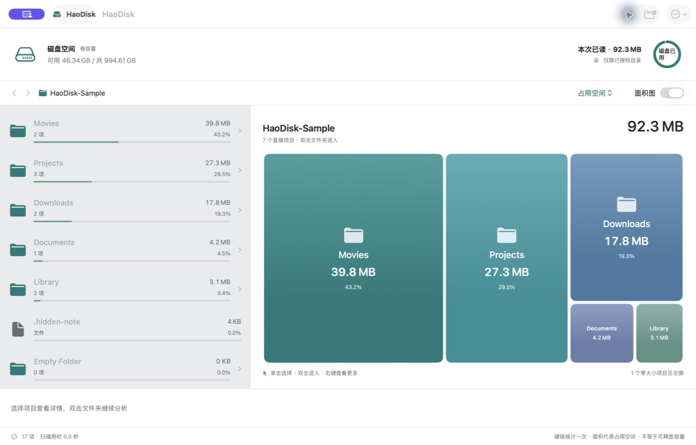

# HaoDisk

A small, native macOS disk space analyzer built with Swift, SwiftUI, AppKit and Foundation.

把空间，看明白。按文件夹查看大小和面积占比，逐层找到占空间的项目，检查后移到系统废纸篓。



## 功能

- 左侧目录列表与右侧矩形面积图联动，按大小排序；支持双击下钻、面包屑、前进 / 后退和表格模式。
- 切换磁盘占用空间与逻辑文件大小；展示整卷容量和本次已读容量。
- 后台扫描、实时进度、可取消、隐藏文件、硬链接去重和读取问题清单。
- 系统目录选择器授权；保存最近一个目录的授权，重启后可继续，随时忘记。
- 手动待清理清单、父子项去重、清理前文件与路径身份检查、文件夹内容复核、逐项结果反馈和自动重扫。
- 原生深浅色外观、系统字体、键盘菜单、面积图辅助功能标签；不依赖 WebView。

## 在 Xcode 中运行

1. 用 Xcode 15 或更新版本打开 `HaoDisk.xcodeproj`。项目支持 macOS 14+。
2. 选择 `HaoDisk` scheme，在 Signing & Capabilities 中选择自己的开发者 Team；必要时更换 Bundle Identifier。
3. Run，点击“选择文件夹”并授权。
4. 选择项目查看详情，双击目录继续分析；通过“加入待清理”进入确认清单。

已提交完整 `.xcodeproj`，直接打开即可，无需安装 XcodeGen 或其他依赖。`project.yml` 仅供修改工程结构后重新生成使用。

```sh
# 无第三方依赖的核心测试
swift test

# 不依赖开发证书的本地构建检查
xcodebuild -project HaoDisk.xcodeproj -scheme HaoDisk \
  -configuration Release -derivedDataPath .build/xcode \
  CODE_SIGNING_ALLOWED=NO build

# Xcode 原生 XCTest；测试不会操作用户文件或清空废纸篓
xcodebuild -project HaoDisk.xcodeproj -scheme HaoDisk \
  -destination 'platform=macOS' CODE_SIGN_IDENTITY=- CODE_SIGNING_REQUIRED=NO test
```

## 容量与清理边界

| 情况 | 行为 |
| --- | --- |
| 符号链接 | 只统计链接本身，不跟随目标，交给 Finder 管理 |
| 硬链接 | 同一卷、同一文件身份计一次；容量归属首次遇到的目录 |
| 稀疏 / 压缩文件 | 逻辑大小与已分配大小分开显示 |
| APFS 克隆、快照、共享块 | 不声称能够精确计算实际可释放空间 |
| 云端占位文件 | 读取文件系统元数据，不读取正文、不主动下载 |
| 无权限目录、其他挂载卷 | 标记扫描不完整，提供详情；其他卷可单独选择 |
| 取消 / 超过 500,000 个项目 | 显示部分结果，禁止本次结果的清理 |
| 系统目录、Library、应用 / 资料包 | 可在系统允许时分析，禁止清理这些项目及包含它们的目录 |
| 移到废纸篓失败 | 保留失败信息；不会降级为永久删除 |

只清理用户明确选中的普通文件与目录，不提供自动缓存清理、永久删除、系统瘦身或“全盘一定可读”的承诺。移动到废纸篓不等于立即释放空间。

## 工程

```text
HaoDisk/
├── Core/          扫描、文件身份、面积布局、清理策略
├── UI/            原生界面、状态管理、授权书签
├── Resources/     App Sandbox、隐私声明、图标
└── HaoDiskApp.swift
HaoDiskTests/      核心行为与清理边界测试
docs/             计划、验证记录、App Store 准备
```

当前界面语言为简体中文。无账号、联网权限、遥测、第三方 SDK 或运行时依赖。

隐私说明：[PRIVACY.md](PRIVACY.md) · 开发计划：[PLAN.md](docs/PLAN.md) · 发布准备：[APP_STORE.md](docs/APP_STORE.md) · 验证记录：[VALIDATION.md](docs/VALIDATION.md)
