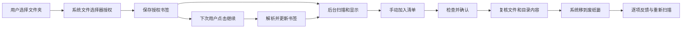

# Mac App Store 准备

首版采用 App Store 沙箱路线。本地可构建和沙箱运行已验证，仍需正式归档、分发验证、App Store Connect 配置和 Apple 审核。没有提交或上架的自动承诺。

## 权限设计

| Entitlement | 用途 |
| --- | --- |
| `com.apple.security.app-sandbox` | Debug / Release 都启用 App Sandbox |
| `com.apple.security.files.user-selected.read-write` | 仅通过系统选择器授权用户目录，支持确认后的废纸篓操作 |
| `com.apple.security.files.bookmarks.app-scope` | 保存最近一个目录的访问授权 |

Release 禁止注入调试用基础 entitlement。正式分发包应没有 `get-task-allow`。工程不包含网络、Apple Events、辅助功能、root、临时沙箱例外、第三方安装器或更新器。

`NSAppDataUsageDescription` 解释用户主动选择范围内的其他应用资料分析；这不是绕过 macOS 权限的手段。Library / 应用资料包仅供分析，清理功能不修改其中内容。

## 授权流程

书签解析失败时要求重新选择；不使用普通路径字符串假装获得访问权限。扫描和清理期间保留授权，切换或忘记时释放。

## 隐私清单

| API 类别 | 理由 | 实际用途 |
| --- | --- | --- |
| DiskSpace | `85F4.1` | 向用户显示磁盘空间 |
| FileTimestamp | `3B52.1` | 用户授权目录内的文件元数据与清理前身份核对 |
| UserDefaults | `CA92.1` | 仅保存本 App 的目录授权书签 |

App Privacy 问卷按当前实现应选择“不收集数据”。发布前根据实际最终构建重新核对，后续新增 SDK 或网络功能需要同步更新。

## 提交前步骤

1. 在 Xcode 选择自己的开发者 Team，确定唯一 Bundle ID；当前默认 `com.haodisk.app` 尚未代为注册。
2. 在 App Store Connect 建立 macOS App，填写定价、地区、年龄分级和简体中文元数据。
3. 提供公开隐私政策 URL、支持 URL、适合商店的截图与最终图标，核对著作权与品牌信息。
4. Product → Archive，选择 Mac App Store Connect 分发，运行 Validate App，核对签名和权限。
5. TestFlight 真机复验：首次授权、拒绝授权、重启恢复、失效书签、移动目录、只读 / 外置卷、iCloud、权限不足、取消、废纸篓失败、深浅色、VoiceOver 和 Intel Mac。
6. 补充审核说明后提交。TestFlight 可用、上传成功、App Store 审核通过是不同状态。

## 审核说明草稿

HaoDisk is a local disk-space analyzer. Click “选择文件夹” to select a folder using the standard macOS Open panel. The app only scans the selected folder and displays file sizes in a list and treemap. It needs no login or network access.

To test cleanup, create a disposable file in a selected ordinary folder, select it, choose “加入待清理”, open “待清理”, review the paths and check the confirmation box, then choose “移到废纸篓”. The app uses FileManager.trashItem and never permanently deletes files or empties Trash. System folders, Library folders, app/data packages, and incomplete scans are protected. The app stores a security-scoped bookmark only for the most recently selected folder; it can be removed from the toolbar menu.

## 参考

- [App Review Guidelines 2.4.5](https://developer.apple.com/app-store/review/guidelines/)
- [Accessing files from the macOS App Sandbox](https://developer.apple.com/documentation/security/accessing-files-from-the-macos-app-sandbox)
- [Required reason API reasons](https://developer.apple.com/documentation/bundleresources/app-privacy-configuration/nsprivacyaccessedapitypes/nsprivacyaccessedapitypereasons)
