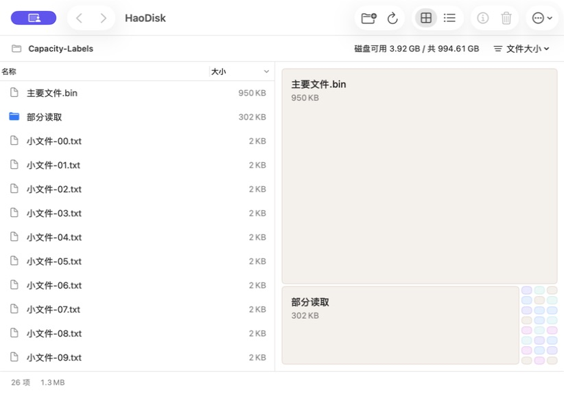
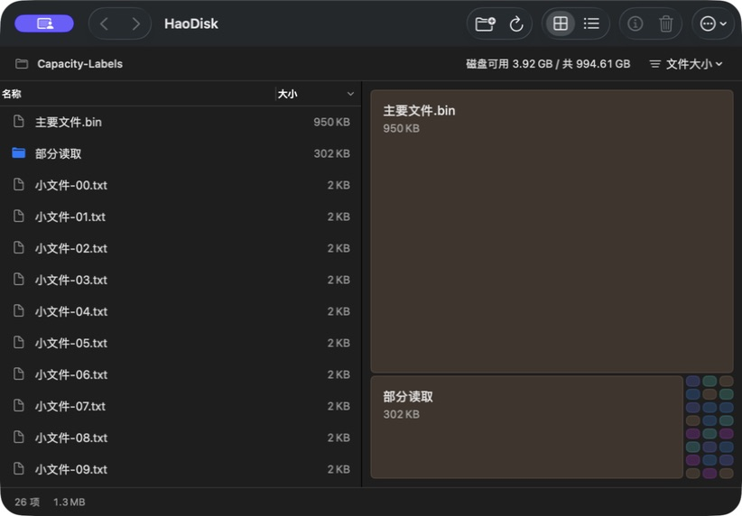
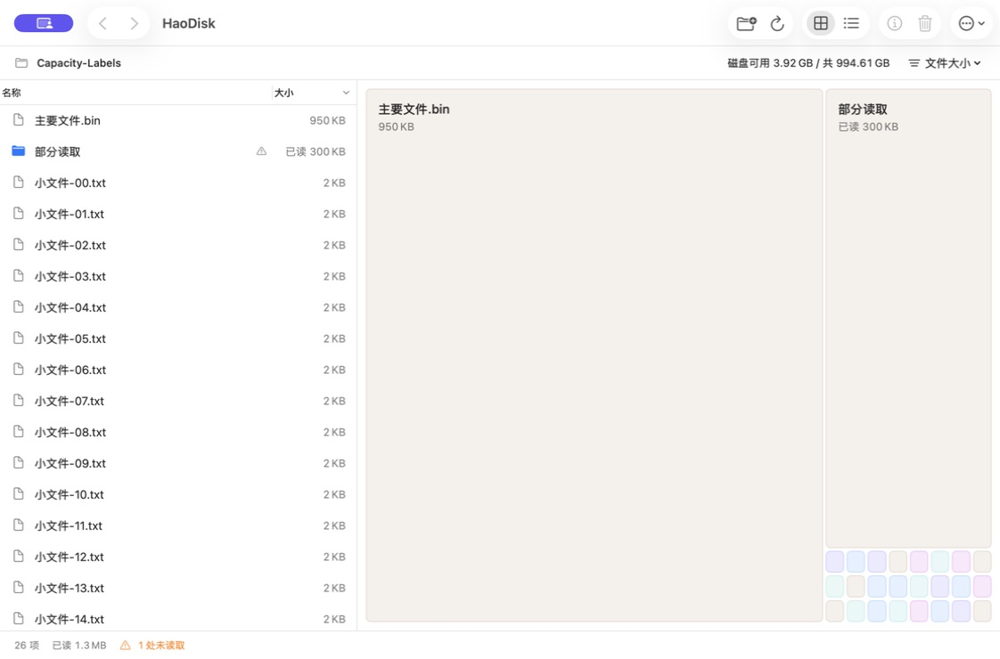
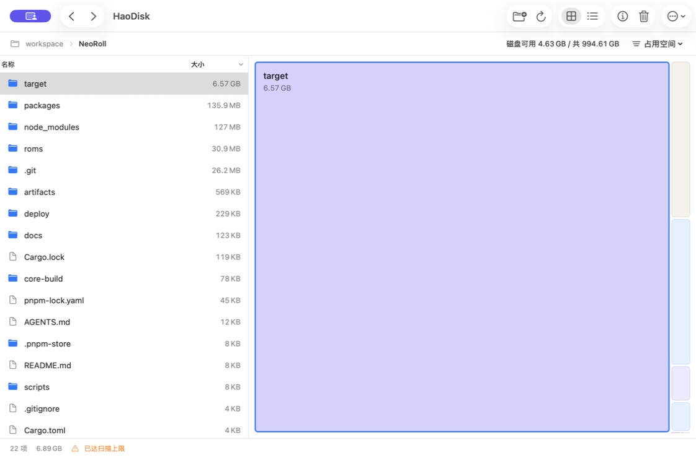

# 0.2.3：浏览性能优化

本轮解决目录选择时的同步清理检查、界面更新时重复遍历行数据，以及方块悬停触发排序和布局的问题。保留原生 SwiftUI / AppKit、沙箱授权、顶部磁盘容量、两种统计方式和清理前的完整复核。

## 实现

| 操作 | 现在的处理 |
| --- | --- |
| 点击、右键、加入清单 | 扫描完成后在后台预计算清理限制；按节点 ID 直接查询。真正清理时仍读取当前路径身份并完整复核文件夹。 |
| 打开目录、切换排序 | 后台准备统一的行 ID、行号索引及方块数据；缓存键包含扫描版本、目录 ID、统计方式和排序。取消过期任务，结果发布前再次核对版本。 |
| 缓存 | 内存中最多 16 个目录展示结果、合计 500,000 个行 ID；按最近使用时间淘汰。只缓存索引与最多 81 个方块的显示信息，不复制节点树。新扫描、切换或忘记授权时失效。 |
| 列表 | 保留 NSTableView 可见行复用，数据键变化时才 reload；选择按索引定位，清单变化只改可见标记。复用图标。 |
| 面积图 | 容量、提示、颜色预先准备；字体尺寸每组方块测量一次，布局只响应目录、统计方式、扫描版本和窗口尺寸。每个方块持有独立悬停状态。 |
| 进度 | 独立 ObservableObject（类似单独的 Vue 响应式组件），每秒最多 5 次进度通知，缓冲区只保留最新一条。扫描后的位置恢复、路径匹配和首屏准备在后台完成。 |
| 重扫中的旧视图 | 节点读取和动作携带扫描版本，旧方块或菜单不得访问重扫后的同号节点。真实清理回归发现并修复了这一越界退出问题。 |

## 性能记录

同一台 Apple M5 Pro / 48 GiB、macOS 26.4、Xcode 26.6；Release 优化。基线为 `de5b67b`（0.2.2），新代码为 0.2.3。合成数据含长中文名称，分别有 12,000 / 100,000 个直接子项；真实 NeoRoll 扫描共 57,224 个节点，target 含 49,789 个后代。

**下表为程序内部耗时，不包含鼠标事件到屏幕呈现的端到端延迟。** 基线清理检查采样 10 次、排序 3 次、方块准备 10 次；新版选择/布局复用各 1,000 次、缓存读取/导航/缩放各 100 次、冷准备 3 次。p95 使用最近秩法。原始结果见 [performance-results.json](performance-results.json)。

| 场景 | 0.2.2 中位数 | 0.2.3 中位数 | 新版 p95 |
| --- | ---: | ---: | ---: |
| target 清理限制 / 选择逻辑 | 799.40 ms | 0.0013 ms | 0.0017 ms |
| 12,000 项首次名称排序 / 完整展示准备 | 681.41 ms（主线程排序） | 78.87 ms（后台，含方块准备） | 80.76 ms |
| 100,000 项首次名称排序 / 完整展示准备 | 7022.47 ms（主线程排序） | 746.62 ms（后台，含方块准备） | 857.27 ms |
| 12,000 项目录缓存读取 | 每次重新排序 | 0.0068 ms | 0.0172 ms |
| 100,000 项目录缓存读取 | 每次重新排序 | 0.0145 ms | 0.0336 ms |
| 100,000 项键盘选择与索引查找 | 未单独记录 | 0.0031 ms | 0.0035 ms |
| 100,000 项方块数据重复准备 / 布局复用 | 176.02 ms | 0.0002 ms | 0.0003 ms |
| 真实目录缓存命中的 Model 前进/后退 | 未单独记录 | 0.0199 ms | 0.0374 ms |
| 100,000 项对应的 81 个方块缩放布局 | 未单独记录 | 0.0261 ms | 0.0293 ms |

重复复用同一方块数据 1,000 次，实际布局计数为 **1**。连续 100 个不同尺寸会重新排版，但字体测量计数仍为 1。选择路径没有文件系统查询、子树遍历和排序；性能目标在 Model 层满足。自动化未记录严格的鼠标到帧呈现 p95，不能把上述数值当作完整界面帧耗时。

## 主线程采样与内存

在实际工作区达到 500,000 节点扫描上限后，使用 macOS `sample` 每 1 ms 采样，覆盖 target 选择、方块间移动/点击、前进后退和缩放。原版点击路径曾出现 1,053 个主线程样本停在 `refreshSelection → CleanupPolicy.reason`，其中 912 个落在保护路径标准化及可达性查询；最终版 20 秒采样中未出现该调用栈，也未采到浏览操作调用 `FileIdentity.read`、`faccessat` 或 `standardizedFileURL`。

| 现场读数 | 物理内存 | 进程峰值 |
| --- | ---: | ---: |
| 原版工作区采样 | 868.7 MB | 1.2 GB |
| 最终版工作区采样 | 651.5 MB | 1.2 GB |
| 最终版再做 16 次缓存导航及一次选择后 | 651.9 MB | 1.2 GB |

扫描仍需保留节点与系统文件元数据，50 万节点时内存不会降至小目录水平。上述是原生应用现场读数，受系统分配器和采样交互影响，不是仅缓存的精确占用，也不是长期泄漏证明；缓存的两项硬上限另由自动测试验证。新增后台路径处理逐项释放 Foundation 临时对象，避免预计算累积大量临时路径对象。

## 回归与真实沙箱验证

| 场景 | 结果 |
| --- | --- |
| 自动测试 | 27 项 Swift Package 测试、32 项 Xcode XCTest 全部通过。包含两种统计口径、自然排序、部分扫描、路径与包保护、符号链接、文件变化复核。 |
| 缓存限制 | 100,000 行 × 8 种展示键后仅保留 5 个结果 / 500,000 行；20 个小目录后最多保留 16 个。覆盖 LRU、超过单项预算不缓存、重扫版本变化、清空及取消。 |
| 过期结果 | 连续进入、前进后退、切换统计与排序，最新请求胜出；新扫描替换和忘记授权后旧任务不得回写，旧节点 ID 操作被拒绝。 |
| 真实工作区 | 签名沙箱应用恢复原 workspace 授权；选择占比超过 95% 的 target、双击进入、工具栏前进后退及大小方块选择联动正常。 |
| 12,000 个实际文件 | 原生表格连续下滚/上滚，行内容正确；滚动到第 50 项后加入清单，仅标记更新，滚动位置保留。其余 11,920 项仍为合计入口，80 个独立块保留。 |
| 最小窗口 / 深浅色 | 顶部容量完整，小块按可读尺寸显示；系统外观和窗口尺寸已恢复。 |
| 部分读取 | 自建无权限子目录，方块和列表显示“已读 300 KB”，底部保留未读取提示；测试权限已恢复。 |
| 扫描取消 | 实际停止工作区扫描后显示“扫描已停止”和已读结果；重新扫描成功。 |
| 真正清理文件夹 | 最终签名版本将自建 DiscardAfterReview 连同内容移到系统废纸篓，自动重扫后从 3 项变为 2 项；应用保持运行。 |
| 审阅后变化 | 审阅自建 ChangedAfterReview 后修改其子文件；清理被拒绝，显示文件夹内容变化原因，文件与内容均在原处。未清理用户工作区数据。 |
| 构建和授权 | Release 同时包含 arm64 / x86_64，Apple Development 签名严格校验通过；仍只有 app-sandbox、user-selected.read-write、bookmarks.app-scope 三项权限。 |

悬停状态已在代码中隔离到单块，系统 `.help` 继续提供完整名称、容量与占比。真实采样覆盖鼠标在方块间移动与点击，但工具未单独捕获系统悬停浮层；高刷新率帧稳定性和纯悬停端到端延迟仍需 Instruments / 人工进一步测量。100,000 直接子项采用内存测试数据，原生 UI 长列表实测为 12,000 个实际文件。

## 复现

在仓库根目录运行（真实目录参数可选；当前真实目录测量使用其中的 target 子目录）：

```sh
swiftc -O HaoDisk/Core/*.swift HaoDisk/UI/DiskModel.swift HaoDisk/UI/MapLayout.swift scripts/performance-benchmark.swift -o /tmp/haodisk-performance
/tmp/haodisk-performance /path/to/NeoRoll
swift test
xcodebuild -project HaoDisk.xcodeproj -scheme HaoDisk -destination 'platform=macOS,arch=arm64' CODE_SIGN_IDENTITY=- CODE_SIGNING_REQUIRED=NO test
```






