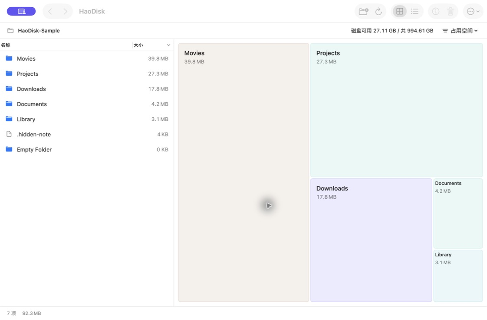
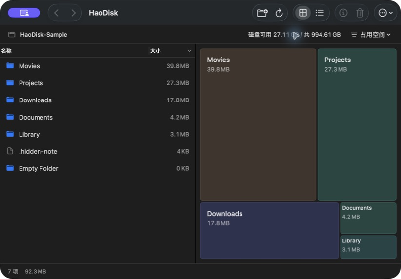
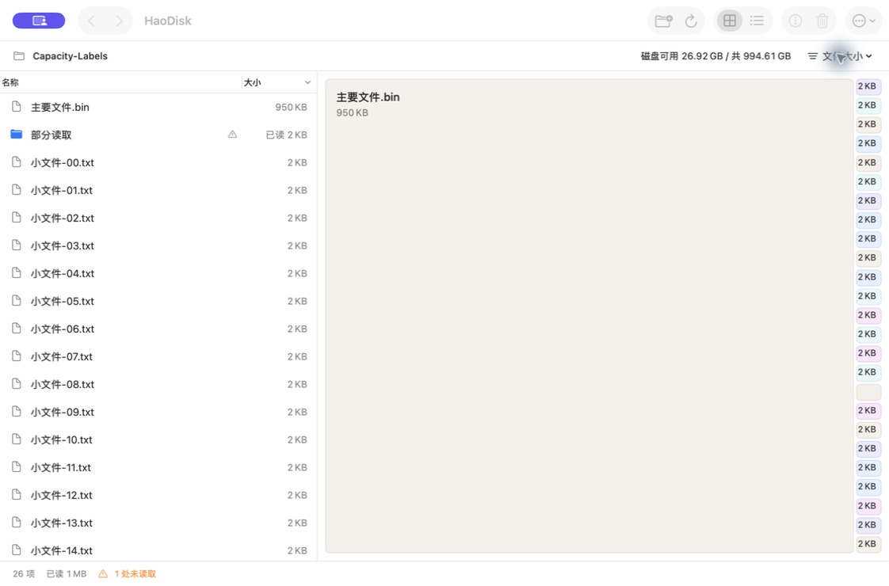
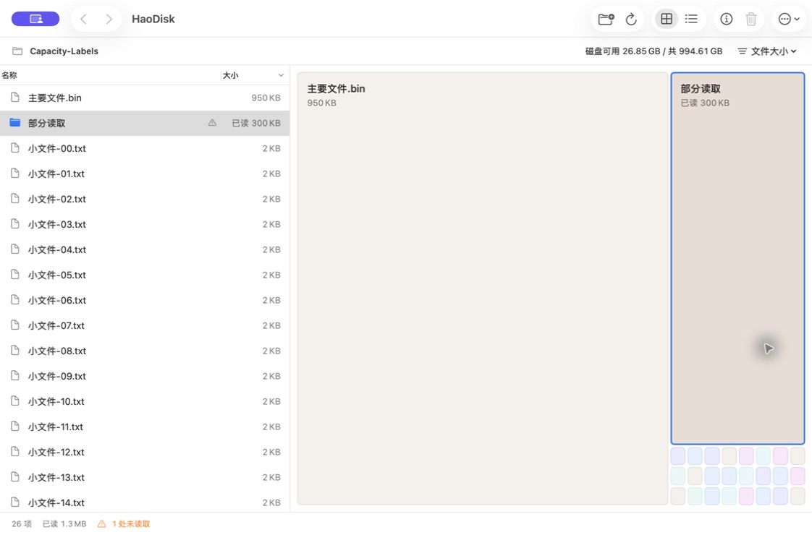

# 0.2.2：磁盘容量与面积图

顶部路径栏常驻显示所选目录所在磁盘的可用空间和总容量，点击展开详情。容量在后台扫描目录之前读取，扫描结束后刷新；切换授权目录、忘记授权会清除旧状态，未知值显示“—”。底部只保留目录统计和操作状态。

面积图的大块显示名称和容量，小块优先显示容量，极小块仍保留独立几何和系统悬停提示。文字按实际字体尺寸与矩形宽高决定显示层级，不压缩字号，也不人为放大面积。单行小块缩小内边距至 2 pt。最多显示 80 个独立项目，超出部分保留总容量和进入列表的入口。零容量项目只出现在列表。

## 验证结果

环境：Apple Silicon、macOS 26.4、Xcode 26.6。本机 Apple Development 签名的沙箱 Release App，版本 0.2.2 (4)。

| 场景 | 证据 |
| --- | --- |
| 自动测试 | 21 项 Swift Package 测试、23 项 Xcode XCTest 通过；新增极小项目保留、80 项上限与汇总、统计方式切换、未知磁盘容量、容量状态清除回归。 |
| 首次扫描 | 恢复原授权范围后，在仍扫描 111,104 项时顶部已经显示磁盘容量；无需等待扫描结束。 |
| 窗口与外观 | 默认窗口和最小 820×520 内容区域，深浅色模式下顶部完整显示；系统外观恢复为原有浅色。 |
| 单行容量 | 自建 950 KB 主文件占已读逻辑大小 95%；右侧 24 个小文件独立保留并显示 2 KB。 |
| 部分读取 | 自建目录包含无权限子目录；可读部分变为 300 KB 后，方块和列表均显示“已读 300 KB”，清理入口保持受限。 |
| 多项目 | 12,000 个小文件显示 80 个独立块与“其余 11920 项 / 48.8 MB”；汇总入口进入完整列表并选中项目。 |
| 两种容量口径 | 稀疏文件在占用空间模式为 0，仍可在列表中访问；切换文件大小后方块显示 10.74 GB，顶部磁盘容量不随口径变化。 |
| 导航与审阅 | 实际双击下钻、返回上层、小块选择与列表联动通过；自建文件进入清理审阅后取消并移出清单，未删除用户数据。 |
| 构建 | Release arm64 / x86_64 构建通过，签名严格校验通过；保持原有三个沙箱授权，无新增权限。 |

系统 `.help` 提供名称、容量与占比（不完整项目改为读取说明）。本轮已验证小块选择和简介读取，但自动化工具未捕获到系统悬停浮层，不将其列为截图实证。

## 原生应用截图

极端细小的块可能仍放不下容量；保留真实比例，列表和简介可查看完整信息。本次没有验证新外置卷、Intel 或 macOS 14 真机，也没有进行 App Store 提交。
