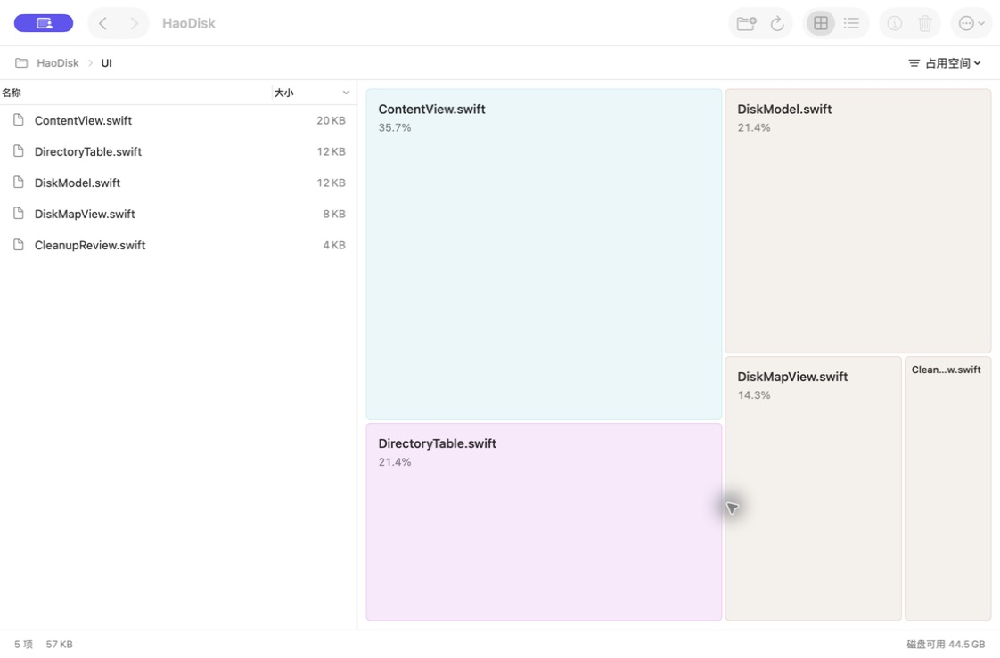
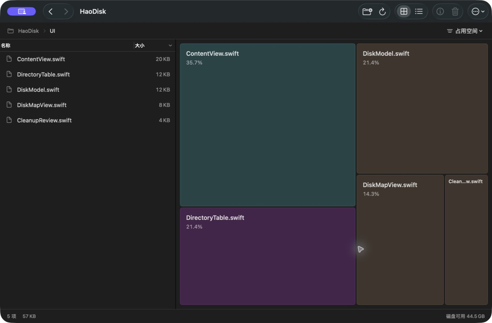
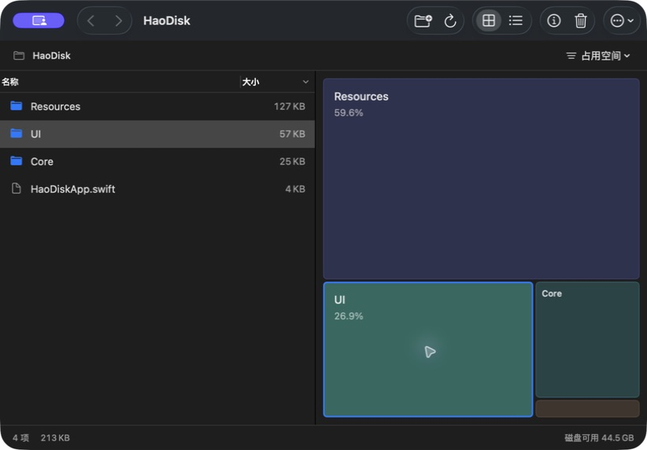
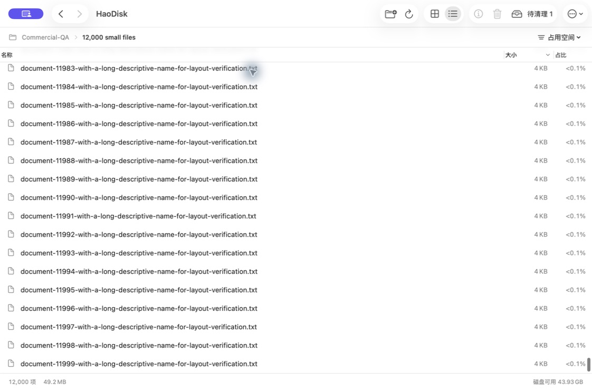
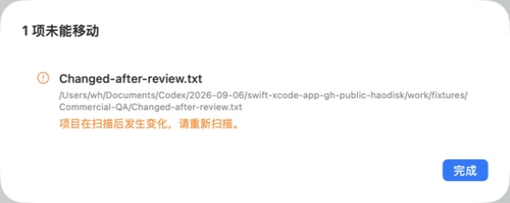

# HaoDisk 0.2 商业化候选版验收

目标：让用户在日常目录中快速定位空间来源，并在明确审阅后可靠地整理文件。标准是可交付的分析工作区和完整状态处理，不用新增账号、订阅或冗余看板代替产品打磨。

## 质量门槛与结果

| 门槛 | 0.2 实现与实测 |
| --- | --- |
| 分析空间优先 | 一条系统工具栏、37 pt 路径栏、31 pt 状态栏。删除重复品牌、容量大卡片、图表重复标题、常驻操作提示和底部清理面板。常用窗口中主工作区约占 84% 高度。 |
| 一处信息承担一种任务 | 列表负责名称 / 大小，面积图负责比例；完整表格增加占比列。详情、磁盘容量、权限帮助按需展开。非零微小占比显示 `<0.1%`。 |
| 原生交互一致 | NSTableView 复用可见行；点击、双击、方向键、Return、⌘↑/↓、⌘[/]、⌘1/2、⌘I、⌘⌫。表头与菜单排序共用状态，列表与面积图共用选择。 |
| 刷新保持上下文 | 同一授权目录重扫后保留当前路径、选择、历史与仍有效的清单；忙碌时禁用冲突操作。实测重扫后仍位于 Movies，并保留 Travel.mov；取消审阅后重扫仍保留待清理项。 |
| 清理需要明确决定 | 选中 → 单张审阅清单 → 明确点击“移到废纸篓”。移除重复勾选和重复长警告；保留完整路径查看、受保护路径、文件身份 / 目录内容复核与失败反馈。 |
| 普通和异常状态完整 | 空目录、无权限、扫描取消、成功清理和扫描后文件变化均已在原生 App 中实测。失败项保留在清单，不自动重试。结果与问题清单随条目数调整高度。 |
| 最小窗口与深浅色 | 本机拖动窗口，验证最小内容 820×520 与约 1120×740 常用窗口；深浅色真实目录、选择高亮、表格、面积图和详情已检查。系统外观已恢复到原有浅色。 |

## 实际验收数据

1. **真实工程目录**：扫描本仓库（含 `.build` 与 `.git`），2,241 个构建文件所在树参与扫描；`.build` 约占 99.5%。小块入口可以切换到表格并选中首个剩余项目。截图进一步展示本仓库实际 UI 源码子目录；没有将用户私人目录上传。
2. **大量直接子项**：自建真实文件系统目录含 12,000 个长文件名，完整扫描、键盘进入、End 跳转末尾、选择最后一项、显示简介均通过。可见行复用，不为全部项目创建 SwiftUI 行；这不是正式帧率或峰值内存基准。
3. **深层长路径**：中文长目录名加八层子目录，方向键连续下钻到文件；路径栏保留末两层，祖先进入可操作菜单，菜单能直接返回授权根。长名称截断时可在简介或悬停中读取完整内容。
4. **极端大小**：10 GiB 稀疏文件，逻辑大小显示 10.74 GB，实际分配为 0；与 12,000 个小文件混合时两种统计口径的排序和面积随之改变。零分配项目仍可在列表访问。
5. **空与不完整**：空文件夹显示真实空状态；自建 mode 000 目录显示“未读取”和清理禁用原因，权限恢复后可以正常重扫。⌘R 紧接 ⌘. 取消扫描后显示“扫描未完成”，说明仅为已读内容，可重新扫描恢复。
6. **清理成功**：仅使用自建 `Cleanup-Disposable.txt`；一次审阅后源路径消失，系统废纸篓同名项存在，App 重扫显示“已移到废纸篓 1 项”。未清空废纸篓，未修改用户既有文件。
7. **清理拒绝**：对自建 `Changed-after-review.txt` 打开审阅后在外部改写内容。App 拒绝移动，显示“项目在扫描后发生变化”，保留文件和失败项清单。没有退化成永久删除。
8. **签名沙箱恢复**：退出并启动本机开发证书签名的 Release App，点击“打开上次的文件夹”，成功解析授权书签并重新扫描；三个授权 entitlement 与 0.1 保持一致。

## 截图

截图来自运行中的原生 App，数值来自文件系统；小窗口中未标注的微小矩形可悬停或使用列表查看。截图包含的文件名均属于此公开项目或自建验证目录。

## 构建与发布边界

- Swift Package：16 项核心测试；Xcode XCTest：17 项（包含原生状态模型导航 / 排序 / 审阅测试）。
- Release：arm64 / x86_64 通用二进制，本机 Apple Development 签名；正式 Mac App Store 分发签名和审核尚未完成。
- CI 同时执行核心测试、Xcode 原生测试、Release 构建、隐私与权限文件检查。
- 最低部署目标是 macOS 14；当前运行验证在 Apple Silicon、macOS 26.4、Xcode 26.6 完成。Intel 与旧系统尚未真机验证。
- 仍待正式发布：开发者 Team / Bundle ID 与商店记录、定价和商店素材、隐私 / 支持 URL、分发 Archive / Validate / TestFlight、Intel 与旧系统、iCloud / 外置和只读卷、VoiceOver 完整流程与授权长期失效场景。详见 [APP_STORE.md](APP_STORE.md)。
- 容量是扫描时的观察，不是可释放空间保证。APFS 共享块、快照和废纸篓影响实际释放；系统路径式废纸篓 API 与其他写入进程之间不提供全局原子事务。

商业化候选版代表本次交互和工程质量门槛通过，不代表已经可在 App Store 购买或获得审核批准。
